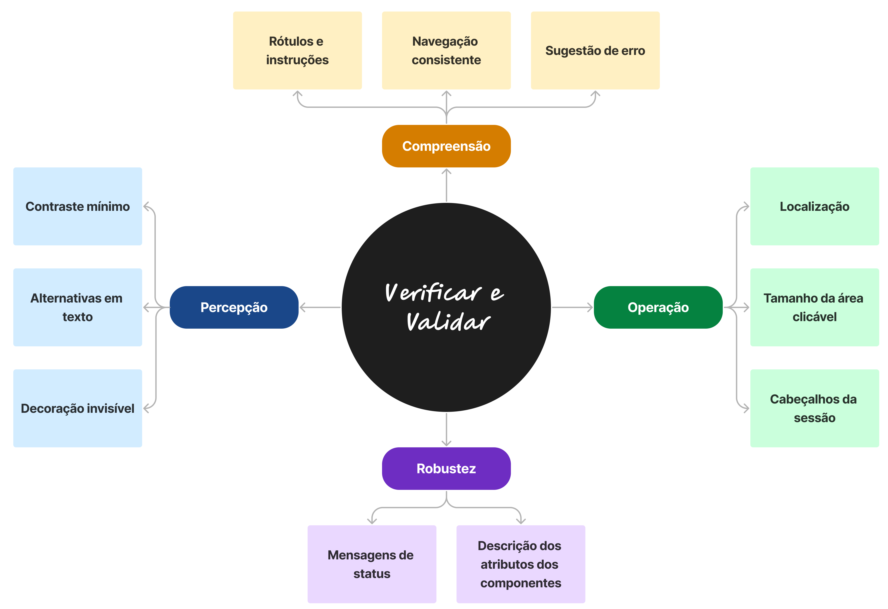

# 2.1 Idéia

A acessibilidade é um tema amplo e diz respeito, principalmente, à capacidade de
tornar os produtos, serviços e informações utilizáveis por pessoas com diferentes habilidades e necessidades. 
Existem diversas maneiras de se observar e testar aspectos relacionados à acessibilidade. 
 
 
Considerando a abrangência das normas, a comunidade envolvida, e o reconhecimento internacional, foi selecionado o Web Content Accessibility Guidelines (WCAG), desenvolvido pelo World Wide Web Consortium (W3C), como base das orientações propostas. A abordagem sugerida busca conduzir o processo de verificação e validação, seguindo os quatro principais pilares citados, pela norma, como fundamentais para promover a acessibilidade. Atualmente, cada um dos pilares apresenta ao menos uma diretriz e diversos critérios de sucesso, o que pode tornar o processo de conformidade longo e complexo. 
 
 
Levando em consideração a análise de diversos guias de acessibilidade e pontos problemáticos comuns em outras aplicações, foram selecionados alguns aspectos-chave e algumas recomendações essenciais a serem abordadas para garantir uma experiência mais acessível, principalmente, a usuários com deficiência visual, objetivando reduzir o esforço necessário para cumprir os requisitos e facilitar a implementação das melhorias. Dessa forma, os pilares e os fundamentos adotados para o processo podem ser ilustrados conforme a Figura abaixo.

Quanto aos critérios selecionados e aos quatro pilares utilizados para agrupá-los,
podem ser detalhados:

- Percepção: As informações e os componentes da interface do usuário devem ser
apresentáveis aos usuários de maneira que possam ser percebidos por, pelo menos,
um de seus cinco sentidos;
- Operação: Os usuários devem ser capazes de operar a interface, a fim de realizar
qualquer ação solicitada pelo sistema;
- Compreensão: Os conteúdos devem estar dentro do limite de compreensão dos
usuários, e facilmente disponíveis através de operações que o público consiga realizar, e
- Robustez: Os sistemas podem ser interpretados de forma confiável por uma ampla variedade de
agentes de usuário, incluindo tecnologias assistivas, permitindo que os conteúdos
possam ser acessados independente dos avanços das tecnologias.

*Todas as referências utlilizadas podem ser encontradas no artigo publicado.*