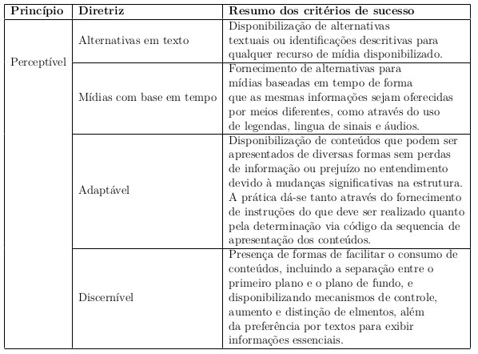
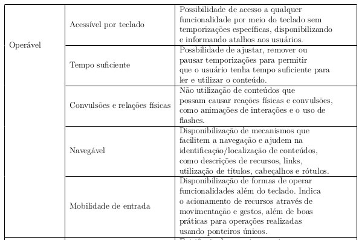
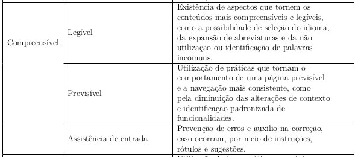
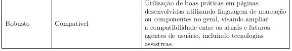

# 2.2 Princípios

As diretrizes e os critérios de sucesso estão organizados em torno dos quatro princípios seguintes, que estabelecem as bases necessárias para que qualquer pessoa possa acessar e utilizar o conteúdo da Web. 

## Percepção

Diz respeito à importância de avaliar se os conteúdos são perceptíveis
para todos os usuários. 

Em específico para atender e testar as percepções que afetam mais o público que possui algum tipo/grau de deficiência visual, foram adotados três critérios principais:

1. **Contraste mínimo de cores**: Consiste em garantir que haja um contraste suficiente entre os elementos
visuais, como texto e fundo, para torná-los legíveis para pessoas com baixa visão ou dificuldades de leitura; 
2. **Alternativas em texto**: Visam fornecer alternativas textuais,
como descrições de imagens, transcrições de áudio ou legendas em vídeos, para que pessoas com deficiência visual possam compreender o conteúdo, e 
3. **Decoração invisível**: Pretende garantir que conteúdos meramente decorativos e formatações visuais sejam
implementados de forma a serem ignorados pelas tecnologias assistivas;

## Operação

O princípio envolve garantir que sejam fornecidos métodos de navegação claros
e consistentes, permitindo que os usuários controlem a reprodução de mídia e interajam
por meio de diferentes dispositivos de entrada. 

Em específico para atender e testar as percepções que afetam mais o público que possui algum tipo/grau de deficiência visual, foram adotados três principais pontos de
observação: 

1. **Localização**: Onde qualquer usuário deve poder orientar-se facilmente em
qualquer parte da tela, em qualquer tela; 
2. **Tamanho das áreas clicáveis**: De forma que
seja possível assegurar que tenham tamanho suficiente para serem facilmente selecionadas
por usuários que usem tecnologias assistivas, como teclados auxiliares ou dispositivos
apontadores alternativos, e 
3. **Cabeçalhos da sessão**: Onde todas as sessões utilizadas
para dividir as telas devem devem possuir títulos claros, com níveis de hierarquia bem
definidos, facilitando a identificação das áreas;

## Compreensão

O princípio da compreensão destaca a importância de tornar os conteúdos compreensíveis
para todos os usuários. Isso inclui diretrizes relacionadas à linguagem simples e clara;
à organização lógica do conteúdo; à consistência na apresentação de informações, e ao
fornecimento de orientações claras e intuitivas para a navegação e a interação. 

As diretrizes e critérios de sucesso relacionados a esse princípio podem ser resumidos através do quadro:

Em específico para atender e testar as percepções que afetam mais o público que possui algum tipo/grau de deficiência visual, foram selecionados os critérios: 

1. **Rótulos e instruções**: Para que todos os rótulos descrevam de
forma clara e não ambígua a finalidade dos campos de formulário; 
2. **Navegação consistente**: Permite que os usuários desenvolvam uma compreensão intuitiva da interface
e naveguem com confiança através de menus, elementos e recursos localizados em locais
consistentes em todas as páginas, e 
3. **Sugestão de erro**: Garante que caso hajam
erros, os mesmos sejam identificados e descritos para o usuário, de forma que este consiga
entender e contornar o erro.

## Robustez

Enfatiza a necessidade de desenvolver conteúdos que sejam compatíveis
com diferentes tecnologias e navegadores, garantindo que a acessibilidade seja mantida, e
tudo possa ser interpretado de forma confiável por uma ampla variedade de ferramentas.

Em específico para atender e testar as percepções que afetam mais o público que possui algum tipo/grau de deficiência visual, foram selecionados os critérios:
 
1. **Mensagens de status**: Para que conteúdos
sejam implementados para fornecer informações aos usuários comunicando o status de
uma ação ou processo em uma interface sem dar foco, e 
2. **Descrição dos atributos dos componentes (ou nome, função, valor)**: Para garantir que todos os componentes de
interface, incluindo nome, estado, função, propriedades e valores, possam ser descritos
para os usuários por meio de tecnologias assistivas.

*Todas as referências utlilizadas podem ser encontradas no artigo publicado.*