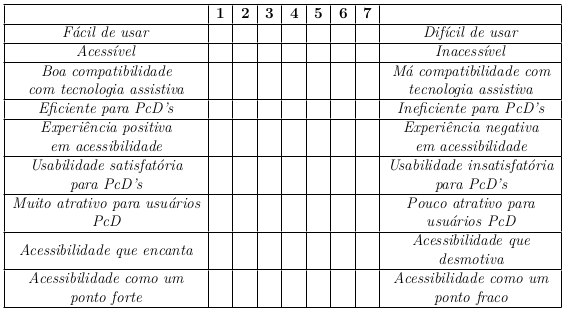

# 2.4   Validação de Acessibilidade

Descrita como o processo de avaliação da qualidade de produtos, ou componentes, de forma que as necessidades dos usuários sejam atendidas ao
utilizá-lo, o principal objetivo da validação é garantir que o produto correto esteja sendo
desenvolvido. Tendo como principal base os requisitos funcionais e não funcionais estabelecidos, através da validação é possível garantir, ao final ou ao longo das fases de
desenvolvimento, que o produto entregue será alinhado com as expectativas do usuário
final.

### Teste de usabilidade

Testes de usabilidade foram utilizados para checar se o software é fácil de usar,
compreender e navegar por pessoas com diferentes habilidades. Durante a realização dos
testes de usabilidade com foco na acessibilidade, foi possível identificar, através da observação direta, possíveis barreiras ou dificuldades enfrentadas pelos usuários ao interagir
com o aplicativo. Para isso, foram considerados perfis variados de usuários que representem a maior diversidade possível dentro dos limites da deficiência visual. Os usuários
foram convidados a realizar tarefas típicas do software enquanto eram observados, e a
contribuir posteriormente com feedbacks sobre suas experiências e os desafios enfrentados
durante os testes.

O Android Talkback foi utilizado como principal ferramenta de apoio, permitindo
validar se as informações são comunicadas de maneira clara, e se as interações são devidamente reconhecidas pelo leitor de tela. Além disso, auxiliou na identificação de problemas relacionados à ordem de leitura, à legibilidade do conteúdo, e à usabilidade geral do aplicativo por usuários com deficiência visual. No intuito de conferir um exemplo de como a ferramenta atua, tem-se um vídeo 1 que ilustra o momento que um áudio é gerado na tela,
pelo TalkBack, quando um item de tela é tocado.

Para padronizar a execução do teste, foram realizadas as seguintes etapas:

1. Introdução à pesquisa: Os usuários receberam um detalhamento sobre o intuito
geral do teste, sobre qual o aplicativo objeto de estudo e uma breve descrição de
quais etapas seriam realizadas.
2. Assinatura do termo de consentimento: Os usuários foram instruídos a ler e
assinar o termo de consentimento, caso consentissem em participar da pesquisa. Para
otimizar o tempo de leitura, foi disponibilizada também a opção onde o aplicador
do teste realizaria a leitura e apresentaria as explicações de cada parte do termo.
3. Informes principais: Após a assinatura do termo, foram explicados o propósito e
os objetivos específicos do teste, deixando claro que a identidade dos testadores seria
mantida em sigilo, e que o teste tinha como objetivo avaliar apenas o sistema em
questão, e não as habilidades dos voluntários. Além disso, os participantes receberam
um aviso para indicar o início das gravações.
4. Solicitação de informações do usuário: Foram solicitadas as respostas neces-
sárias para preencher o formulário de informações do usuário, que foi devidamente
respondido pelo avaliador em cada um dos testes.
5. Lembretes e execução das atividades: Após finalizado o preenchimento do
questionário, o avaliador requisitou que os participantes verbalizassem quaisquer
dúvidas, pois isto ajudaria na descrição e entendimento dos problemas encontrados,
e que deixassem claro o que estavam tentando fazer e por quê estavam tentando
fazer daquela forma.
6. Período de feedback: Assim que as tarefas foram finalizadas, foi disponibilizado
um tempo para coleta de feedbacks e opiniões gerais

Com o objetivo de avaliar a acessibilidade, ou a ausência dela, no aplicativo, foram
selecionados dois grupos de testadores com perfis distintos. O primeiro grupo foi composto
por usuários altamente habilidosos e experientes em tecnologia, que se aproximam mais ao
perfil de ajudante. O segundo grupo incluía pessoas com pouca familiaridade e habilidade
em tecnologia, mais próximas do perfil de ajudado. Para conduzir essas avaliações, foram
selecionadas atividades com base nos fluxos mais comuns do sistema, aqueles com os quais
a maioria dos usuários tinha algum contato. São elas:

- A01 - Cadastro no aplicativo;
- A02 - Fornecimento de informações extra;
- A03 - Visualização do mapa completo;
- A04 - Interação com uma oferta/pedido de outro usuário;
- A05 - Edição de perfil;
- A06 - Edição de endereço, e
- A07 - Login no aplicativo.

A partir da realização das atividades, foram observadas, documentadas e analisa-
das as seguintes medidas:
  
* Tempo de finalização das atividades: O tempo que os testadores levaram para
realizar tarefas específicas no software foi documentado e avaliado. A métrica serviu
de auxílio para avaliar a eficiência da interação e a facilidade em realizar ações
específicas.  
* Taxa de sucesso na conclusão das atividades: A proporção de testadores que
conseguiram concluir com sucesso as tarefas designadas foi relatada, trazendo indí-
cios sobre a eficácia do sistema em atender às necessidades dos usuários.  
* Relatos e feedbacks: Os comentários, opiniões e observações subjetivas dos tes-
tadores sobre a experiência de uso foram registradas, incluindo pontos positivos e
negativos.  
* Efetividade da tecnologia assistiva: Foi avaliado como a tecnologia assistiva,
como leitores de tela, lupas de tela ou teclados em Braille, interagiu com o sistema
e se funcionou conforme o esperado.  

### Questionários

Embora os questionários não forneçam uma avaliação completa e detalhada da
acessibilidade, os mesmo têm seu valor, e podem conferir revelações valiosas sobre a percepção dos usuários em relação à acessibilidade do produto. Além do formulário que permitiu armazenar informações importantes do usuário, como faixa etária e escolaridade,
também foi utilizada uma adaptação do questionário AttrakDiff para validar a experiência do usuário nesse contexto. Foram realizadas adequações para que, de acordo
com os critérios selecionados pela abordagem, o questionário incluísse aspectos relacionados à acessibilidade e à qualidade da experiência do usuário, principalmente em termos de usabilidade. Sendo assim, a pretensão foi focar na Qualidade Pragmática (QP), acordada no AttrakDiff, havendo a necessidade de adequação dos pares de termos definidos na versão original do questionário, visando contemplar os pilares: Percepção, Operação,
Compreensão e Robustez.

#### Informações dos Usuários

Inicialmente, após a concordância e a assinatura do termo de consentimento, os
usuários foram convidados a responder um questionário com dados pessoais, e este foi
preenchido pelo aplicador do teste para facilitar o processo e evitar complicações relacio-
nadas à acessibilidade de questionários. O intuito principal foi coletar dados básicos dos
usuários para caracterizá-los de acordo com o perfil de usuário que mais se aproxima, e
registrar como seus conhecimentos e habilidades podem ter influenciado nas facilidades ou
obstáculos encontrados durante a realização das atividades. Para isso, foram selecionadas
as seguintes questões:

1. Qual o nome do usuário?
2. Qual a faixa etária do usuário?
3. Qual o gênero do usuário?
4. Qual o nível de escolaridade do usuário?
5. O usuário trabalha atualmente?
6. Qual a deficiência do usuário?
7. O usuário utiliza o leitor de tela ou outras tecnologias assistivas com frequência?
8. Onde ele costuma utilizar?

#### Attrakdiff

Após a realização do teste, foi proposto o preenchimento do questionário Attrak-
Diff que, em linhas gerais, permitiu coletar feedbacks qualitativos e quantitativos sobre a
percepção dos usuários em relação à atratividade, usabilidade e qualidade, dentre outros
aspectos observados na aplicação. Através dos pares de palavras selecionados, foram co-
letadas informações subjetivas sobre como os testadores perceberam a acessibilidade do
aplicativo, incluindo a facilidade de uso com tecnologia assistiva, a clareza do conteúdo,
a navegabilidade e a experiência global em termos de acessibilidade.
A aplicação de uma adaptação do questionário foi uma estratégia para avaliar a
acessibilidade do aplicativo mantendo o viés da experiência do usuário. 

A partir dos pares de palavras selecionadas, também foi possível avaliar aspectos relacionados à usabilidade
geral, como a eficiência na realização de tarefas, a clareza das informações e a satisfação
geral. Para isso, a montagem dos campos e palavras foi feita de acordo com o quadro a seguir:

*Todas as referências utlilizadas podem ser encontradas no artigo publicado.*