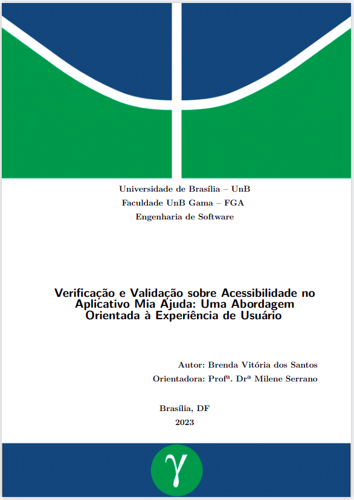

  

  
  <h3 style="color: #011640; text-align: center">
Com o propósito de fomentar a adoção de práticas de acessibilidade, especialmente no âmbito tecnológico, a abordagem desenvolvida ao longo do trabalho encontra-se agora disponível online, acessível a qualquer interessado. É relevante salientar que essa disponibilização não integra a própria abordagem, mas serve como um recurso facilitador para consulta e utilização por terceiros. A bordagem proposta conta com instruções de Verificação e Validação que podem ser reproduzidas em outras aplicações móveis para avaliar a Acessibilidade do sistema. Foi desenvolvida utilizando testadores que portam algum tipo de deifiência visual, mas os critérios podem ser adaptados para atender melhor quando outros tipos de deficiência são colocadas em foco.
  </h3>

<h1 style="color: #011640; font-weight: bold; text-align: center"> Links Úteis </h1>

<a href="https://github.com/brendavsantos">
  

	
  

	<h4 class="legenda">Autora</h4>
	<h6 class=legenda>Brenda Santos</h6>
</a>
<a href="https://github.com/brendavsantos">
  

	
  

	<h4 class="legenda">TCC</h4>
	<h6 class=legenda>Link para a publicação</h6>
</a>

